# Common Registers and Operation (Device) 1.2

## Introduction
This document defines the standards that new Harp Devices should strive to follow. The goal is to create a common ground for the development and operation of Harp devices, to allow quick and easy integration of new devices into the existing ecosystem. While some registers and functionalities are not mandatory, it is strongly recommended that they are implemented or, at least, considered with compatibility in mind.

### Common Registers

The `Common Registers` are a set of registers that are common to all Harp Devices. These registers are used to identify the device, its version, and its operation mode. The `Common Registers` are mandatory and should be implemented in all Harp Devices. Summary description of each register can be found in [this table](ref missing).

All other registers pertaining to the operation of a specific device (`Application Registers`) should always take a register number equal, or greater, than 32. Moreoever, numbering and naming of these registers will be left to the developer, as they are specific to each device.

### Operation Modes

A Harp Device is expected to implement the following `Operation Modes`:

* **`Standby Mode:`**  Replies to host commands. Events are disabled and must not be sent.
* **`Active Mode:`** Replies to host commands. Events are enabled and sent to host whenever the device deems it so.
* *`Speed Mode:`* Allows the implementation of a different and specific communication protocol. On this mode, the Harp Binary Protocol is no longer used. The specific protocol designed must implement the possibility to exit this mode.

The mandatory Operation Modes are the **`Standby Mode`** and **`Active Mode`**. The **`Speed Mode`** is optional and, in many of the applications, not needed.
It’s strongly recommended that a Harp Device acting as peripheral should continuously check if the communication with the host is active and healthy. If this doesn’t happen over the last 3 seconds, the Harp Device should go to Standby Mode and flush/destroy its TX buffer.

## Registers

### Common Registers

**Table - List of available Common Registers**

|**Name**|**Volatile**|**Read Only**|**Type**|**Add.**|**Default**|**Brief Description**|**Mandatory**|
| :- | :-: | :-: | :-: | :-: | :-: | :- | :-: |
|R\_WHO\_AM\_I|-|Yes|U16|000|a)|Who am I|Yes|
|R\_HW\_VERSION\_H|-|Yes|U8|001|a)|Major Hardware version|Yes|
|R\_HW\_VERSION\_L|-|Yes|U8|002|a)|Minor Hardware version|Yes|
|R\_ASSEMBLY\_VERSION|-|Yes|U8|003|a)|Version of the assembled components|Optional|
|R\_CORE\_VERSION\_H|-|Yes|U8|004|a)|Major core version|Optional|
|R\_CORE\_VERSION\_L|-|Yes|U8|005|a)|Minor core version|Optional|
|R\_FW\_VERSION\_H|-|Yes|U8|006|a)|Major Firmware version of the application|Yes|
|R\_FW\_VERSION\_L|-|Yes|U8|007|a)|Minor Firmware version of the application|Yes|
|R\_TIMESTAMP\_SECOND|Yes|No|U32|008|0|System timestamp: seconds|Yes|
|R\_TIMESTAMP\_MICRO|Yes|Yes|U16|009|0|System timestamp: microseconds|Optional|
|R\_OPERATION\_CTRL|No|No|U8|010|b)|Configuration of the operation mode|c)|
|R\_RESET\_DEV|No|No|U8|011|b)|Reset device and save non-volatile registers|Optional|
|R\_DEVICE\_NAME|No|No|U8|012|b)|Name of the device given by the user|Optional|
|R\_SERIAL\_NUMBER|No|No|U16|013|b)|Unique serial number of the device|Optional|
|R\_CLOCK\_CONFIG|No|No|U8|014|b)|Synchronization clock configuration|Optional|
|R\_TIMESTAMP\_OFFSET|No|No|U8|015|b)|Adds an offset if user updates the Timestamp|Optional|

||a) These values are stored during factory process and are persistent, i.e., they cannot be changed by the user. b) Check register notes on the specific register explanation c) Only parts of the functionality is mandatory. Check register notes on the explanation.|
| :- | :- |

<!---
Tables can be generated here https://www.tablesgenerator.com/html_tables
Mermaid plots can be generated here: https://mermaid.live/
--->

#### **`R_WHO_AM_I` (U16) – Who Am I**

Address: `000`

```mermaid
---
displayMode: compact
---

gantt
    title R_WHO_AM_I (000) [U16]

    dateFormat X
    axisFormat %
    tickInterval 0

    section Bit
    15-8      :byte1, 0, 1
    7-0      :byte0, after byte1  , 2
    section Id
    WHO_AM_I      :id1, 0, 2
    section Default
    0      :d1, 0, 2
```

Used to verify the identity of the device. A list of devices can be found at <https://github.com/harp-tech/protocol>. To reserve a range or certain IDs for your project or company, please follow the instructions in this repository. If the device doesn’t have a pre-allocated ID on the IDs list, this register should be set as 0.

#### **`R_TIMESTAMP_SECOND` (U32) – System timestamp (seconds)**

Address: `008`

Contains the current system timestamp in whole seconds. The default value is 0 (ZERO) and will increment one unit for each elapsed second.

```mermaid

---
displayMode: compact
---

gantt
    title R_TIMESTAMP_SECONDS (008) [U32]

    dateFormat X
    axisFormat %
    tickInterval 0

    section Bit
    31-24      :byte3, 0, 1
    23-16      :byte2, after byte3  , 2
    15-8      :byte1, after byte2  , 3
    7-0      :byte0, after byte1  , 4
    section Id
    SECONDS      :id1, 0, 4
    section Default
    0      :d1, 0, 4
```

#### **`R_TIMESTAMP_SECOND` (U16) – System timestamp (seconds)**

Address: `009`

Contains the microseconds count within each second. Each LSB corresponds to 32 microseconds. The maximum value is 31249.

```mermaid
---
displayMode: compact
---

gantt
    title R_TIMESTAMP_SECONDS (009) [U16]

    dateFormat X
    axisFormat %
    tickInterval 0

    section Bit
    15-8      :byte1, 0, 1
    7-0      :byte0, after byte1  , 2
    section Id
    USECONDS      :id1, 0, 2
    section Default
    -      :d1, 0, 2
```

#### **`R_OPERATION_CTRL` (U16) – Operation mode configuruation**

Address: `010`

```mermaid

---
displayMode: compact
---

gantt
    title R_OPERATION_CTRL (010)
    dateFormat X
    axisFormat %

    section Bit
    7      :bit7, 0, 1
    6      :bit6, after bit7  , 2
    5      :bit5, after bit6  , 3
    4      :bit4, after bit5  , 4
    3      :bit3, after bit4  , 5
    2      :bit2, after bit3  , 6
    1      :bit1, after bit2  , 7
    0      :bit0, after bit1  , 8
    section Id
    ALIVE_EN      :id7, 0, 1
    OPLEDEN      :id6, after bit7  , 2
    VISUALEN      :id5, after bit6  , 3
    MUTE_RPL      :id4, after bit5  , 4
    DUMP      :id3, after bit4  , 5
    -      :id2, after bit3  , 6
    OP_MODE      :id1, after id2  , 8
    section Default
    1      :d7, 0, 1
    1      :d6, after bit7  , 2
    1      :d5, after bit6  , 3
    0      :d4, after bit5  , 4
    0      :d3, after bit4  , 5
    -      :d2, after bit3  , 6
    0      :d1, after d2  , 8
    section Implementation
    Optional      :i7, 0, 1
    Optional      :i6, after bit7  , 2
    Optional      :i5, after bit6  , 3
    Optional      :i4, after bit5  , 4
    Optional      :i3, after bit4  , 5
    -      :i2, after bit3  , 6
    a)      :i1, after i2  , 8


```

a) Standby Mode and Active Mode are mandatory. Speed Mode is optional.

* **OP_MODE [Bits 1:0]:** These bits define the operation mode of the device. Note that, if Speed Mode is selected, the device will no longer reply to the HARP commands, only to its specific Speed Mode commands.

**Table - Available Operation modes**

| OP_MODE[1:0] 	| Configuration                                                                                          	|
|--------------	|--------------------------------------------------------------------------------------------------------	|
| 0            	| Standby Mode. The device has all the `Events` turned off.                                              	|
| 1            	| Active Mode. The device turns ON the `Events` detection. Only the enabled Events will be operating.    	|
| 2            	| Reserved.                                                                                              	|
| 3            	| Speed Mode. The device enters Speed Mode.                                                              	|

* **DUMP [Bit 3]:** When written to 1, the device adds the content of all registers to the streaming buffer as `Read` messages. This bit is always read as 0.
* **MUTE_RPL [Bit 4]:** If set to 1, the `Replies` to all the `Commands` are muted, i.e., they will not be sent by the device.
* **VISUALEN [Bit 5]:** If set to 1, visual indications, typically LEDs, available on the device will operate. If equals to 0, all the visual indications should turn off.
* **OPLEDEN [Bit 6]:** If set to 1, the LED present on the device will indicate the Operation Mode selected.

**Table - Visual LED toggle feedback**

| Period (s) 	| Operation Mode                                                                                           	|
|------------	|----------------------------------------------------------------------------------------------------------	|
| 4          	| Standby Mode.                                                                                            	|
| 2          	| Active Mode.                                                                                             	|
| 1          	| Speed Mode.                                                                                              	|
| 0.1        	| A critical error occurred. Only a hardware reset or a new power up can remove the device from this Mode. 	|

* **ALIVE_EN [Bit 7]:** If set to 1, the device sends an `Event` Message with the `R_TIMESTAMP_SECONDS` content each second (i.e. Heartbeat). This allows the host to check that the device is alive. Although this is an optional feature, it’s strongly recommended to be implemented.

#### **`R_RESET_DEV` (U8) – Reset device and save non-volatile registers**

Address: `011`

---
displayMode: compact
---
gantt
    title R_RESET_DEV (011)
    dateFormat X
    axisFormat %

    section Bit
    7      :bit7, 0, 1
    6      :bit6, after bit7  , 2
    5      :bit5, after bit6  , 3
    4      :bit4, after bit5  , 4
    3      :bit3, after bit4  , 5
    2      :bit2, after bit3  , 6
    1      :bit1, after bit2  , 7
    0      :bit0, after bit1  , 8
    section Id
    BOOT_EE      :id7, 0, 1
    BOOT_DEF      :id6, after bit7  , 2
    -      :id5, after bit6  , 3
    -      :id4, after bit5  , 4
    NAME_TO_DEFAULT      :id3, after bit4  , 5
    SAVE      :id2, after bit3  , 6
    RST_EE      :id1, after id2  , 7
    RST_DEF      :id0, after id1  , 8

    section Default
    -      :d7, 0, 1
    -      :d6, after bit7  , 2
    -      :d5, after bit6  , 3
    -      :d4, after bit5  , 4
    0      :d3, after bit4  , 5
    0      :d2, after bit3  , 6
    0      :d1, after bit2  , 7
    0      :d0, after bit1  , 8

* **RST_DEF [Bit 0]:** If set to 1, the device resets and, reboots with all the registers, both `Common` and `Application`, with the default values. EEPROM will be erased, and the default values will be restored as the permanent boot option. This bit is always read as 0.

* **RST_EE [Bit 1]:** If set to 1, the device resets and reboots with all the registers, both `Common` and `Applicatin` registers, with the values saved on the non-volatile memory, usually an EEPROM. The EEPROM values will remain the permanent boot option. This bit is always read as 0.

* **SAVE [Bit 3]:** If set to 1, the device will save all the non-volatile registers (both `Common` and `Application`) to the internal non-volatile memory, and reboot. The non-volatile memory should be the permanent boot option.

* **NAME_TO_DEFAULT [Bit 4]:** If set to 1, the device will reboot with the default name. This bit is always read as 0.

* **BOOT_DEF [Bit 6]:** A read-only state bit that indicates whether the device booted with the default register values or not.

* **BOOT_EE [Bit 7]:** A read-only state bit that indicates whether the device booted with the register values saved on the EEPROM or not.

> **Note**
>
> To avoid unexpected behaviors, only one bit at a time should be written to register `R_RESET_DEV`.

