

# Device Registers and Operation

This document defines the set of functionality that every Harp device is expected to provide. The goal is to establish a common interface for the development and operation of all Harp hardware, and to allow quick and easy integration of new devices into the existing ecosystem.

## Requirements Language

The key words "MUST", "MUST NOT", "REQUIRED", "SHALL", "SHALL NOT", "SHOULD", "SHOULD NOT", "RECOMMENDED",  "MAY", and "OPTIONAL" in this document are to be interpreted as described in [RFC 2119](https://www.ietf.org/rfc/rfc2119.txt).

## Device Interface

All Device functionality, including device configuration, SHOULD be provided to the Controller using the [Harp Binary Protocol](BinaryProtocol-8bit.md), and documented using a standardized Device Interface. The Device Interface is described by a collection of hardware registers defined by a unique memory location. These memory locations are often tied to hardware-related functionality, such that changing the value of the register directly changes the operation of the Device.

For example, a register can be used to configure device properties such as sampling frequency, operation mode, input / output routing, and other device-specific parameters. A register can also be used to control specific functionality, such as toggling digital output lines, starting and stopping pulse trains, or moving a motor.

Each register in the Device Interface is assigned a unique zero-based address, and a payload type describing the format of the data stored in the register. Registers can be read-only or allow both reading and writing.

Except for [Optional or Deprecated registers](#optional-or-deprecated-registers), whose behavior is clarified below, all registers and functionality specified in this document MUST be implemented by a Device complying with this specification.

## Operation Mode

The following Device operation modes MUST be implemented:

- `Standby:` All `Event` messages are disabled and MUST NOT be sent to the Controller.
- `Active:` All `Event` messages are enabled and SHOULD be sent to the Controller following the Device specification.

The Device SHOULD continuously check if communication with the Controller is active and healthy. This status check will be largely dependent on the communication interface used to implement the Harp protocol between Controller and Device. Each implementation SHOULD allow distinguishing between `Connected` and `NotConnected` states, and it is up to the developer to decide how to implement this status check. When the Device transitions to the `NotConnected` state, it MUST immediately enter `Standby` and stop transmission of further `Event` messages.

As an application example, a Device communicating over a serial port MAY poll for an active connection by checking whether the state of the DTR pin is `HIGH`. Once the DTR pin is brought `LOW`, the Device SHOULD assume the Controller closed the connection and enter `Standby`. The Controller MUST update the state of the DTR line when opening or closing a new serial connection to the Device.

## Messaging Patterns

All exchanges of data between the Controller and the Device SHOULD use the following messaging patterns.

* **Request-Reply**: The Controller sends a message to the Device requesting to read or write register contents. The Device replies with a message back to the Controller containing the latest register contents.
* **Event Stream**: The Device sends event messages to the Controller reporting the contents of specific registers, whenever an external or internal event of interest happens.
* **Error Handling**: The Device sends an error message whenever there is an error processing a Controller request, or if the Device enters an exceptional error state requiring immediate action from the Controller.

The following sections provide a detailed specification on implementing each of these patterns.

### Request-Reply

A Device MUST process any `Write` and `Read` requests sent from the Controller. For each request arriving from the Controller, a reply message with the same message type, register address, and register type MUST be returned by the Device, unless the Device is configured to mute all replies (see **MUTE_RPL [Bit 4]** in [`R_OPERATION_CTRL`](#r_operation_ctrl-u8--operation-mode-configuration) below), in which case the Device SHALL NOT send reply messages for any Controller requests.

All reply messages sent by the Device MUST be timestamped with the Harp clock time at which the request was processed.

> [!NOTE]
>
> For requests triggering a fast action, the reply timestamp SHOULD indicate the time at which the action is finished. However, if a request triggers a long-running action, the reply timestamp SHOULD indicate the time at which the action has started. An event register MAY be used to report when a long-running action completes.

The payload of the reply message SHOULD represent the up-to-date state of the register targeted by the request, after the request is processed. If a `Write` request is sent, the payload of the reply MAY be different from the payload of the original request, e.g. if the Device needs to transform or adjust the actual value written on the register ([see "Register Polymorphism" section below](#register-polymorphism)).

The Device SHOULD NOT send more than a single reply message. The only supported exception is the operation of the [`R_OPERATION_CTRL`](#r_operation_ctrl-u8--operation-mode-configuration) register, which allows the Controller to request a dump of all registers in the Device. In this case, the Device replies with a single `Write` message from `R_OPERATION_CTRL`, in accordance with the above specification. However, if **DUMP [Bit 3]** is set, the Device will additionally emit a sequence of `Read` messages back-to-back, containing the state of each register in the Device.

### Event Stream

A Device MAY send to the Controller `Event` messages reporting the contents of specific registers at any time. Sending of events depends on the Device [Operation Mode](#operation-mode). A Device SHOULD NOT send `Event` messages when in `Standby` mode.

When the Device is in `Active` mode, device-specific application registers can be used by the Controller to further restrict the sending of events. The documentation of each device interface should be consulted to understand the operation of such registers.

All `Event` messages sent by the Device SHOULD be timestamped with the Harp clock time as early as possible following the event trigger.

### Error Handling

The [`Error`](BinaryProtocol-8bit.md#error-flag-1-bit) flag in the [`MessageType`](BinaryProtocol-8bit.md#messagetype-1-byte) field MAY be set by the Device on messages signalling an error while processing a request from the Controller. The Device SHALL NOT send any error replies to the Controller when configured to mute all replies (see [Request-Reply](#request-reply)). Since information included in error messages is limited, we RECOMMEND restricting error replies to the following cases:

  1. The message is a request to read (or write) a register that does not exist on the Device.
  2. The message [`PayloadType`](BinaryProtocol-8bit.md#payloadtype-1-byte) does not match the register specification.
  3. The message is a write request to a read-only register.
  4. The message is a write request, and the length of the payload does not match the register specification.
  5. The message is a write request, and the payload is outside the allowable range of register values.

Requests which require prior configuration of multiple registers (e.g. starting a pulse train, moving a motor), or requests which are invalid due to particular combinations of other register values, SHOULD NOT be handled by sending an error reply to a write request from the Controller.

Instead, such cases MAY be handled by sending an event message from a different register. Alternatively, an allowed value MAY be set by the Device, in which case the reply to the request MUST contain the actual register value which was set.

> [!NOTE]
>
> A Device MAY reject a change to the register value. In this case, a reply to the write request MUST still be sent, containing the current register value.

If an event message is sent from a register as a result of a write request sent to a different register, the documentation for the register sending the event SHOULD clearly indicate which cases will raise the event, including specific combinations of values leading to error.

### Register polymorphism

A Device SHOULD NOT accept or send different types of data for the same register address. The protocol was designed to be as simple as possible, and having different types of data in the same register would make the parsing and manipulation of messages unnecessarily complex.

Messages sent from a specific Device register SHOULD:
  1. have a single data type (e.g. `U8`) for all message types (`Read`, `Write`, `Event`)
  2. have the same message length for all message types, if the register is a fixed-length register
  3. have a payload with the same functional semantics regardless of the message type (see examples below)

> **Example**
>
> Consider the following register:
>
>```
>   CameraFrequency:
>   - Address: 32
>   - Type: U8
>   - Access: Read, Write
>   - Description: Sets the frequency of the camera in Hz.
>```
>
> ❌ DO NOT reply with a frequency in U16 for a `Read` request and the frequency in U8 for a `Write` request.  
> ❌ DO NOT reply with a frequency in Hz for a `Read` request and the period in seconds for a `Write` request.  
>
> ✅ DO reply with a frequency in U8 for both a `Read` and `Write` request.  
> ✅ DO reply with a frequency in Hz for both a `Read` and a `Write` request.  
> ✅ CONSIDER accepting an approximate value for frequency in `Write` requests from the Controller, if the Device is able to determine a valid exact frequency from the request. In this case, DO reply with the exact frequency value set by the Device.

### Message Exchange Examples

Some Harp message exchanges are shown below to demonstrate the typical usage of the protocol between a Device and a Controller. Note that timestamp information is usually omitted in messages sent from the Controller to the Device, since actions are expected to run as soon as possible.

We will use the following abbreviations:

- [REQ] is a Request (From the Controller to the Device).
- [REP] is a Reply (From the Device to the Controller).
- [EVT] is an Event (A message sent from the Device to the Controller without a request from the Controller).

#### Write Message

- [REQ] **Controller**:       `2`  `Length` `Address` `Port` `PayloadType` `Payload` `Checksum`
- [REP] **Device**: `2`  `Length` `Address` `Port` `PayloadType` `Timestamp` `Payload` `Checksum`       OK
- [REP] **Device**: `10` `Length` `Address` `Port` `PayloadType` `Timestamp` `Payload` `Checksum`       ERROR

The timestamp information in [REP] represents the time when the register contents were updated.

#### Read Message

- [REQ] **Controller**: `1` `4`      `Address` `Port` `PayloadType` `Checksum`
- [REP] **Device**: `1` `Length` `Address` `Port` `PayloadType` `Timestamp` `Payload` `Checksum`       OK
- [REP] **Device**: `9` `10`     `Address` `Port` `PayloadType` `Timestamp` `Payload` `Checksum`       ERROR

The timestamp information in [REP] represents the time when the register contents were read.

#### Event message

- [EVT] **Device**: `3` `Length` `Address` `Port` `PayloadType` `Timestamp` `Payload` `Checksum`      OK

The timestamp information in [EVT] represents the time when the register contents were read.

## Application Registers

All registers pertaining to the hardware-specific operation of the Device are application registers. Every application register MUST have an address equal to, or greater than, 32. The address, payload type, and naming of application registers is left to the device developer, as it will always be specific to each Device.

## Optional and Deprecated Registers

Some registers are marked as **Optional** or **Deprecated** in the [Core Registers](#core-registers) table, and their functionality MAY not be fully implemented by the Device. However, all optional or deprecated registers MUST reply to `Read` requests by sending a message to the Controller with the specified default value. Moreover, they MUST be included as part of the [`R_OPERATION_CTRL`](#r_operation_ctrl-u8--operation-mode-configuration) register dump.

For any writeable optional or deprecated registers whose function is not implemented, the Device MUST always return a `Write` reply payload containing the register default value, to indicate the `Write` request had no effect. The Device SHOULD NOT crash or enter an undefined state when a `Write` request is sent to an optional or deprecated unimplemented register.

In most cases, the default value of an optional or deprecated register SHOULD be `0` (Zero). Other values MAY be allowed, in which case they MUST be explicitly documented and justified on a per-register basis.

## Core Registers

The following set of Device core registers MUST be implemented. These reserved registers are used to identify the Device, the version of various components, determine the current Device operation mode, and other common operations.

|**Name**|**Volatile**|**Read Only**|**Type**|**Add.**|**Default**|**Brief Description**|**Necessity**|
| :- | :-: | :-: | :-: | :-: | :-: | :- | :-: |
|[`R_WHO_AM_I`](#r_who_am_i-u16--device-identity-class)|-|Yes|U16|000|a)|Device Identity Class|Required|
|[`R_HW_VERSION_H`](#r_hw_version_h-u8--major-hardware-version)|-|Yes|U8|001|a)|Major Hardware Version|Deprecated|
|[`R_HW_VERSION_L`](#r_hw_version_l-u8--minor-hardware-version)|-|Yes|U8|002|a)|Minor Hardware Version|Deprecated|
|[`R_ASSEMBLY_VERSION`](#r_assembly_version-u8--version-of-assembled-components)|-|Yes|U8|003|a)|Version of Assembled Components|Deprecated|
|[`R_CORE_VERSION_H`](#r_core_version_h-u8--major-core-version)|-|Yes|U8|004|a)|Major Core Version|Deprecated|
|[`R_CORE_VERSION_L`](#r_core_version_l-u8--minor-core-version)|-|Yes|U8|005|a)|Minor Core Version|Deprecated|
|[`R_FW_VERSION_H`](#r_fw_version_h-u8--major-firmware-version)|-|Yes|U8|006|a)|Major Firmware Version|Deprecated|
|[`R_FW_VERSION_L`](#r_fw_version_l-u8--minor-firmware-version)|-|Yes|U8|007|a)|Minor Firmware Version|Deprecated|
|[`R_TIMESTAMP_SECOND`](#r_timestamp_second-u32--system-timestamp-seconds)|Yes|No|U32|008|0|System Timestamp (seconds)|Required|
|[`R_TIMESTAMP_MICRO`](#r_timestamp_micro-u16--system-timestamp-microseconds)|Yes|Yes|U16|009|0|System Timestamp (microseconds)|Required|
|[`R_OPERATION_CTRL`](#r_operation_ctrl-u8--operation-mode-configuration)|No|No|U8|010|b)|Operation Mode Configuration|Required|
|[`R_RESET_DEV`](#r_reset_dev-u8--reset-device)|No|No|U8|011|b)|Reset Device|Optional|
|[`R_DEVICE_NAME`](#r_device_name-u8-array--human-readable-device-name)|No|No|U8 Array|012|b)|Human-readable Device Name|Optional|
|[`R_SERIAL_NUMBER`](#r_serial_number-u16--device-serial-number)|No|No|U16|013|b)|Device Serial Number|Deprecated|
|[`R_CLOCK_CONFIG`](#r_clock_config-u8--synchronization-clock-configuration)|No|No|U8|014|b)|Synchronization Clock Configuration|Optional|
|[`R_TIMESTAMP_OFFSET`](#r_timestamp_offset-u8--clock-calibration-offset)|No|No|U8|015|b)|Clock Calibration Offset|Deprecated|
|[`R_UID`](#r_uid-u8-array--unique-identifier)|No|Yes|U8 Array|016|b)|Unique Identifier|Optional|
|[`R_TAG`](#r_tag-u8-array--firmware-tag)|-|Yes|U8 Array|017|b)|Firmware Tag|Optional|
|[`R_HEARTBEAT`](#r_heartbeat-u16--device-status-information)|Yes|Yes|U16|018|b)|Device Status Information|Required|
|[`R_VERSION`](#r_version-u8-array--device-version-information)|-|Yes|U8 Array|019|a)|Device Version Information|Required|

||a) These values MUST be stored during the firmware build process and are persistent, i.e. they SHALL NOT be changeable by the Controller.<br>b) Check notes on the specific register specification. |
| :- | :- |

<!---
Tables can be generated here https://www.tablesgenerator.com/html_tables
Mermaid plots can be generated here: https://mermaid.live/
--->

### **`R_WHO_AM_I` (U16) – Device Identity Class**

Address: `000`  
Length: 1

```mermaid
---
displayMode: compact
---

gantt
    title R_WHO_AM_I (000) [U16]

    dateFormat X
    axisFormat %
    tickInterval 0

    section Bit
    15-8      :byte1, 0, 1
    7-0      :byte0, after byte1  , 2
    section Id
    WHO_AM_I      :id1, 0, 2
    section Default
    0      :d1, 0, 2
```

Specifies the identity class of the Device. The list of reserved device identity classes can be found at [harp-tech/whoami](https://github.com/harp-tech/whoami). To reserve specific device identity classes for your project or company, please follow the instructions in that repository. If the Device does not have a pre-allocated identity class, this register MUST be set to its default value of `0` (Zero).

### **`R_TIMESTAMP_SECOND` (U32) – System Timestamp (seconds)**

Address: `008`  
Length: 1

```mermaid
---
displayMode: compact
---

gantt
    title R_TIMESTAMP_SECONDS (008) [U32]

    dateFormat X
    axisFormat %
    tickInterval 0

    section Bit
    31-24      :byte3, 0, 1
    23-16      :byte2, after byte3  , 2
    15-8      :byte1, after byte2  , 3
    7-0      :byte0, after byte1  , 4
    section Id
    SECONDS      :id1, 0, 4
    section Default
    0      :d1, 0, 4
```

Contains the current system timestamp in whole seconds. The default value is `0` (Zero) and will increment one unit for each elapsed second.

### **`R_TIMESTAMP_MICRO` (U16) – System Timestamp (microseconds)**

Address: `009`  
Length: 1

```mermaid
---
displayMode: compact
---

gantt
    title R_TIMESTAMP_MICRO (009) [U16]

    dateFormat X
    axisFormat %
    tickInterval 0

    section Bit
    15-8      :byte1, 0, 1
    7-0      :byte0, after byte1  , 2
    section Id
    MICROSECONDS      :id1, 0, 2
    section Default
    0      :d1, 0, 2
```

Contains the microseconds count within each second. Each LSB corresponds to 32 microseconds. The maximum value is 31249. The default value is `0` (Zero).

### **`R_OPERATION_CTRL` (U8) – Operation Mode Configuration**

Address: `010`  
Length: 1


a) The `ALIVE_EN` bit is deprecated and may be removed from future protocol versions.

b) `Standby` and `Active` modes are mandatory. `Speed` mode is deprecated.


* **OP_MODE [Bits 1:0]:** These bits define the [Operation Mode](#operation-mode) of the Device.

**Table - Available Operation modes**

| OP_MODE[1:0] 	| Configuration          	|
|--------------	|------------------------	|
| 0            	| Standby Mode            |
| 1            	| Active Mode             |
| 2            	| Reserved                |
| 3            	| Speed Mode              |

> [!WARNING]
>
> `Speed` mode is now deprecated, and SHOULD NOT be implemented in any new devices. This mode was used to support the implementation of dedicated communication protocols. When entering `Speed` mode, the Device SHOULD NOT reply to Controller requests, other than its specific `Speed` mode commands.
>
> The Device MUST reply with `Error` in case this operation mode is not supported.

* **HEARTBEAT_EN [Bit 2]:** If this bit is set, the Device MUST send an `Event` message every second with the contents of [`R_HEARTBEAT`](#r_heartbeat-u16--device-status-information). This allows the Controller to check the status of the Device periodically. If the `ALIVE_EN` bit is also set, this bit has precedence and the Device must send `R_HEARTBEAT` periodically instead of `R_TIMESTAMP_SECOND`.
* **DUMP [Bit 3]:** If this bit is set on a `Write` request, the Device SHALL send a sequence of `Read` messages to the Controller, one per register, with the current contents of all core and application registers. These messages MUST be sent following the `Write` reply to the request from the Controller. When sending a reply to a `Read` request, the Device MUST clear this bit in the message payload.
* **MUTE_RPL [Bit 4]:** If this bit is set, the Device SHALL NOT send any messages in reply to a request from the Controller.
* **VISUAL_EN [Bit 5]:** If this bit is set, any visual indicators, typically LEDs, available on the Device SHOULD be enabled. Otherwise, if the bit is cleared, all visual indicators SHOULD be turned off.
* **OPLED_EN [Bit 6]:** If this bit is set, the LED present on the Device SHOULD indicate the current Operation Mode.

**Table - Visual LED toggle feedback**

| Period (s) 	| Operation Mode                                                                                            |
|------------	|----------------------------------------------------------------------------------------------------------	|
| 4          	| Standby Mode                                                                                              |
| 2          	| Active Mode                                                                                               |
| 1          	| Speed Mode                                                                                                |
| 0.1        	| A critical error occurred. Only a hardware reset or a new power up can remove the Device from this Mode.  |

* **ALIVE_EN [Bit 7]:** If this bit is set, the Device SHOULD send an `Event` message every second with the contents of [`R_TIMESTAMP_SECOND`](#r_timestamp_second-u32--system-timestamp-seconds). This feature has been deprecated and may be removed from future protocol versions. The Controller SHOULD set the `HEARTBEAT_EN` bit and monitor [`R_HEARTBEAT`](#r_heartbeat-u16--device-status-information) instead for periodically checking the status of the Device.

### **`R_RESET_DEV` (U8) – Reset Device**

Address: `011`  
Length: 1

```mermaid
---
displayMode: compact
---
gantt
    title R_RESET_DEV (011)
    dateFormat X
    axisFormat %

    section Bit
    7      :bit7, 0, 1
    6      :bit6, after bit7  , 2
    5      :bit5, after bit6  , 3
    4      :bit4, after bit5  , 4
    3      :bit3, after bit4  , 5
    2      :bit2, after bit3  , 6
    1      :bit1, after bit2  , 7
    0      :bit0, after bit1  , 8
    section Id
    BOOT_EE      :id7, 0, 1
    BOOT_DEF      :id6, after bit7  , 2
    UPDATE_FIRMWARE      :id5, after bit6  , 3
    -      :id4, after bit5  , 4
    NAME_TO_DEFAULT      :id3, after bit4  , 5
    SAVE      :id2, after bit3  , 6
    RST_EE      :id1, after id2  , 7
    RST_DEF      :id0, after id1  , 8

    section Default
    -      :d7, 0, 1
    -      :d6, after bit7  , 2
    -      :d5, after bit6  , 3
    -      :d4, after bit5  , 4
    0      :d3, after bit4  , 5
    0      :d2, after bit3  , 6
    0      :d1, after bit2  , 7
    0      :d0, after bit1  , 8
```

This register is used to reboot the Device, optionally save or restore non-volatile registers, or enter firmware update mode. The Device MUST send a reply to a `Write` request from the Controller before rebooting.

* **RST_DEF [Bit 0]:** If this bit is set, the Device MUST reset and reboot with all core and application registers set to their default values. Any available non-volatile memory MUST be erased and all Device default values MUST be restored as the permanent boot option. When sending a reply to a `Read` request, the Device MUST clear this bit in the message payload.

* **RST_EE [Bit 1]:** If this bit is set and non-volatile memory is available, the Device MUST reset and reboot with all core and application registers set to the values saved in persistent storage, usually an EEPROM. Any currently stored values MUST remain the permanent boot option. If this bit is set and non-volatile memory is not available, the Device MUST reply with an `Error` message. When sending a reply to a `Read` request, the Device MUST clear this bit in the message payload.

* **SAVE [Bit 2]:** If this bit is set and non-volatile memory is available, the Device MUST save any non-volatile core and application registers to persistent storage, and reboot. The non-volatile memory should be configured as the permanent boot option. If this bit is set and non-volatile memory is not available, the Device MUST reply with an `Error` message. When sending a reply to a `Read` request, the Device MUST clear this bit in the message payload.

* **NAME_TO_DEFAULT [Bit 3]:** If this bit is set, the Device MUST reboot and restore the value of [`R_DEVICE_NAME`](#r_device_name-25-bytes--devices-name) to its default value. When sending a reply to a `Read` request, the Device MUST clear this bit in the message payload.

* **UPDATE_FIRMWARE [Bit 5]:** If this bit is set, the Device MUST enter firmware update mode. In this mode the Device MAY NOT reply to any requests until the update completes. Once completed, the Device MUST reboot. When sending a reply to a `Read` request, the Device MUST clear this bit in the message payload.

* **BOOT_DEF [Bit 6]:** When sending a reply to a `Read` request, the Device MUST set this bit if it booted with the default register values. If non-volatile memory is not available, the Device MUST always set this bit when sending a reply to a `Read` request. This bit is read-only state, so if this bit is set on a request message, the Device MUST reply with an `Error` message.

* **BOOT_EE [Bit 7]:** When sending a reply to a `Read` request, the Device MUST set this bit if it booted with register values recovered from persistent storage. If non-volatile memory is not available, the Device MUST always clear this bit when sending a reply to a `Read` request. This bit is read-only state, so if this bit is set on a request message, the Device MUST reply with an `Error` message.

> [!IMPORTANT]
>
> To avoid unexpected behavior, the Controller SHOULD set only one bit at a time when sending a `Write` request to `R_RESET_DEV`.

### **`R_DEVICE_NAME` (U8 Array) – Human-readable Device Name**

Address: `012`  
Length: 25

The bytes in this register specify a human-readable device name. Any unused bytes MUST be set to `0` (Zero). This register is non-volatile. If a `Write` request to this register is received and non-volatile memory is available, the Device MUST reset and save the new register value to persistent storage. Otherwise, if non-volatile memory is not available, the Device MUST reply to any `Write` requests with the default register value.

Providing a non-empty device name is OPTIONAL. If no name is provided, the default value of this register MUST be `0` (Zero).

### **`R_CLOCK_CONFIG` (U8) – Synchronization Clock Configuration**

Address: `014`  
Length: 1

```mermaid
---
displayMode: compact
---
gantt
    title R_CLOCK_CONFIG (014)
    dateFormat X
    axisFormat %

    section Bit
    7      :bit7, 0, 1
    6      :bit6, after bit7  , 2
    5      :bit5, after bit6  , 3
    4      :bit4, after bit5  , 4
    3      :bit3, after bit4  , 5
    2      :bit2, after bit3  , 6
    1      :bit1, after bit2  , 7
    0      :bit0, after bit1  , 8
    section Id
    CLK_LOCK      :id7, 0, 1
    CLK_UNLOCK      :id6, after bit7  , 2
    -      :id5, after bit6  , 3
    GEN_ABLE      :id4, after bit5  , 4
    REP_ABLE      :id3, after bit4  , 5
    -      :id2, after bit3  , 6
    CLK_GEN      :id1, after id2  , 7
    CLK_REP      :id0, after id1  , 8

    section Default
    0      :d7, 0, 1
    1      :d6, after bit7  , 2
    -      :d5, after bit6  , 3
    -      :d4, after bit5  , 4
    -      :d3, after bit4  , 5
    -      :d2, after bit3  , 6
    -      :d1, after bit2  , 7
    -      :d0, after bit1  , 8
```

* **CLK_REP [Bit 0]:** If this bit is set, and a Clock Output connector is available on the device hardware, the Device MUST repeat the Harp Synchronization Clock messages on the Clock Output. This allows daisy-chaining by repeating the Clock Input on the Clock Output. Setting this bit also enables writing on the timestamp register.

* **CLK_GEN [Bit 1]:** If this bit is set, and a Clock Output connector is available on the device hardware, the Device MUST generate Harp Synchronization Clock messages on the Clock Output. Any messages arriving on the Clock Input MUST be ignored by the Device.

* **REP_ABLE [Bit 3]:** Read-only status bit. When sending a reply to a `Read` request, the Device MUST set this bit if it is able to repeat the Harp Synchronization Clock timestamp.

* **GEN_ABLE [Bit 4]:** Read-only status bit. When sending a reply to a `Read` request, the Device MUST set this bit if it is able to generate the Harp Synchronization Clock timestamp.

* **CLK_UNLOCK [Bit 6]:** If this bit is set, the Device MUST enable writing on [`R_TIMESTAMP_SECOND`](#r_timestamp_second-u32--system-timestamp-seconds). When sending a reply to a `Read` request, the Device MUST set this bit if the timestamp register is unlocked.

* **CLK_LOCK [Bit 7]:** If this bit is set, the Device MUST disable writing on [`R_TIMESTAMP_SECOND`](#r_timestamp_second-u32--system-timestamp-seconds). When sending a reply to a `Read` request, the Device MUST set this bit if the timestamp register is locked.

The implementation of this register is RECOMMENDED if the Device provides a [Synchronization Clock](SynchronizationClock.md).

> [!NOTE]
>
> The Device MUST always boot with the timestamp register in the unlocked state.

### **`R_UID` (U8 Array) – Unique Identifier**

Address: `016`  
Length: 16

```mermaid
---
displayMode: compact
---

gantt
    title R_UID (016) [16 Bytes]

    dateFormat X
    axisFormat %
    tickInterval 0

    section Bytes
    15-0      :bytes, 0, 1
    section Id
    UID      :id1, 0, 1
    section Default
    0      :d1, 0, 1
```

An array of bytes specifying a (128-bit) UID (Unique Identifier) for the Device. This register is non-volatile and read-only. The byte-order is little-endian. If not implemented, the Device MUST return a default value of `0` (Zero) for all bytes.

### **`R_TAG` (U8 Array) – Firmware Tag**

Address: `017`  
Length: 8

```mermaid
---
displayMode: compact
---

gantt
    title R_TAG (017) [8 Bytes]

    dateFormat X
    axisFormat %
    tickInterval 0

    section Bytes
    7-0      :bytes, 0, 1
    section Id
    TAG      :id1, 0, 1
    section Default
    0      :d1, 0, 1
```

An array of bytes that can be used to store a tag for a specific firmware build. For instance, it could be used to store the Git hash of a specific release/commit. The byte-order is little-endian. This register is read-only.

If not implemented, the Device MUST return a default value of `0` (Zero) for all bytes.

### **`R_HEARTBEAT` (U16) – Device Status Information**

Address: `018`  
Length: 1

```mermaid
---
displayMode: compact
---
gantt
    title R_HEARTBEAT (018)
    dateFormat X
    axisFormat %

    section Bit
    15-2      :reserved, 0, 1
    1         :bit1, after reserved, 2
    0         :bit0, after bit1, 3

    section Id
    -               :idr, 0, 1
    IS_ACTIVE       :id0, after reserved, 2
    IS_SYNCHRONIZED :id1, after bit1, 3

    section Default
    -      :dr, 0, 1
    -      :d7, after reserved, 2
    -      :d6, after bit1, 3
```

This register is read-only and used to provide status information about the Device. Any changes to the below bits are controlled by the Device and sent to the Controller through a periodic `Event` message. If periodic reporting is enabled by setting [`R_OPERATION_CTRL`](#r_operation_ctrl-u8--operation-mode-configuration) bit `HEARTBEAT_EN`, the Device MUST emit a periodic event on this register at a rate of 1 Hz, in sync with updates to the [`R_TIMESTAMP_SECOND`](#r_timestamp_second-u32--system-timestamp-seconds) register.

* **IS_ACTIVE [Bit 0]:** If this bit is set, the Device MUST be in `Active` mode. This bit MUST be cleared if the Device is in any other mode (see [Operation Mode](#operation-mode) for information on available device modes).

* **IS_SYNCHRONIZED [Bit 1]:** If this bit is set, the Device MUST be synchronized with an external Harp clock generator. If the Device is itself a clock generator (see [`R_CLOCK_CONFIG`](#r_clock_config-u8--synchronization-clock-configuration) bit `CLK_GEN`), this bit MUST always be set.

### **`R_VERSION` (U8 Array) – Device Version Information**

Address: `019`  
Length: 32

```mermaid
---
displayMode: compact
---
gantt
    title R_VERSION (019)
    dateFormat X
    axisFormat %

    section Byte
    0         :prot_major, 0, 1
    1         :prot_minor, after prot_major, 2
    2         :prot_patch, after prot_minor, 3
    3         :fw_major, after prot_patch, 4
    4         :fw_minor, after fw_major, 5
    5         :fw_patch, after fw_minor, 6
    6         :hw_major, after fw_patch, 7
    7         :hw_minor, after hw_major, 8
    8         :hw_patch, after hw_minor, 9
    9-11      :sdk_id, after hw_patch, 12
    12-31     :interface_hash, after sdk_id, 32

    section Id
    PROTOCOL        :protocol, 0, 3
    FIRMWARE        :firmware, after prot_patch, 6
    HARDWARE        :hardware, after fw_patch, 9
    SDK_ID          :sdk, after hw_patch, 12
    INTERFACE_HASH  :protocol, after sdk_id, 32

    section Default
    -      :d0, 0, 3
    -      :d1, after prot_patch, 6
    -      :d2, after fw_patch, 9
    -      :d3, after hw_patch, 12
    -      :d4, after sdk_id, 32
```

The bytes in this register specify the [semantic version](https://semver.org/) of the components making up the Device. Each component version is made up of three bytes, following the order `major`, `minor`, `patch`. The register also includes a unique identifier of the core microcontroller SDK and a hash digest of the interface schema file describing the Device Interface.

* **PROTOCOL:** The semantic version of the Harp protocol implemented by the Device.

* **FIRMWARE:** The semantic version of the Device firmware application.

* **HARDWARE:** The semantic version of the Device hardware.

* **SDK_ID:** The three-character code of the core microcontroller SDK used to implement the Device.

* **INTERFACE_HASH:** The SHA-1 hash value of the Device Interface schema file (`device.yml`). The byte-order is little-endian. The Controller SHOULD NOT perform any validation of its Device Interface schema if this value is set to `0` (Zero). 

## Deprecated Core Registers

The following registers are deprecated and their functionality SHOULD NOT be implemented in new devices. They MUST still exist as read-only registers, and included in the [`R_OPERATION_CTRL`](#r_operation_ctrl-u8--operation-mode-configuration) register dump. They are kept for backward compatibility with older Controllers and may be removed in future protocol versions.

### **`R_HW_VERSION_H` (U8) – Major Hardware Version**

> [!WARNING]
>
> This register is deprecated in favor of [`R_VERSION`](#r_version-u8-array--device-version-information). The value of this register MUST be equal to the major `HARDWARE` version in `R_VERSION`.

Address: `001`  
Length: 1

```mermaid
---
displayMode: compact
---

gantt
    title R_HW_VERSION_H (001) [U8]

    dateFormat X
    axisFormat %
    tickInterval 0

    section Bit
    7-0      :byte0, 0, 1
    section Id
    HW_VERSION_H      :id1, 0, 1
    section Default
    -      :d1, 0, 1
```

Specifies the major hardware version number. The value of this register is persistent and MUST NOT be changeable by the Controller.

### **`R_HW_VERSION_L` (U8) – Minor Hardware Version**

> [!WARNING]
>
> This register is deprecated in favor of [`R_VERSION`](#r_version-u8-array--device-version-information). The value of this register MUST be equal to the minor `HARDWARE` version in `R_VERSION`.

Address: `002`  
Length: 1


Specifies the minor hardware version number. The value of this register is persistent and MUST NOT be changeable by the Controller.

### **`R_ASSEMBLY_VERSION` (U8) – Version of Assembled Components**

> [!WARNING]
>
> This register is deprecated as we do not require tracking the version of assembled components directly in the Device firmware.

Address: `003`  
Length: 1

```mermaid
---
displayMode: compact
---

gantt
    title R_ASSEMBLY_VERSION (003) [U8]

    dateFormat X
    axisFormat %
    tickInterval 0

    section Bit
    7-0      :byte0, 0, 1
    section Id
    ASSEMBLY_VERSION      :id1, 0, 1
    section Default
    0      :d1, 0, 1
```

Specifies the version number of the assembled components. The value of this register is persistent and MUST NOT be changeable by the Controller. If this register is not implemented, it MUST store a fixed default value of `0` (Zero).

### **`R_CORE_VERSION_H` (U8) – Major Core Version**

> [!WARNING]
>
> This register is deprecated in favor of [`R_VERSION`](#r_version-u8-array--device-version-information). The value of this register MUST be equal to the major `PROTOCOL` version in `R_VERSION`.

Address: `004`  
Length: 1


Contains the major version of the Harp protocol specification. The value of this register is persistent and MUST NOT be changeable by the Controller.

### **`R_CORE_VERSION_L` (U8) – Minor Core Version**

> [!WARNING]
>
> This register is deprecated in favor of [`R_VERSION`](#r_version-u8-array--device-version-information). The value of this register MUST be equal to the minor `PROTOCOL` version in `R_VERSION`.

Address: `005`  
Length: 1


Contains the minor version of the Harp Protocol specification. The value of this register is persistent and MUST NOT be changeable by the Controller.

### **`R_FW_VERSION_H` (U8) – Major Firmware Version**

> [!WARNING]
>
> This register is deprecated in favor of [`R_VERSION`](#r_version-u8-array--device-version-information). The value of this register MUST be equal to the major `FIRMWARE` version in `R_VERSION`.

Address: `006`  
Length: 1

```mermaid
---
displayMode: compact
---

gantt
    title R_FW_VERSION_H (006) [U8]

    dateFormat X
    axisFormat %
    tickInterval 0

    section Bit
    7-0      :byte0, 0, 1
    section Id
    FW_VERSION_H      :id1, 0, 1
    section Default
    -      :d1, 0, 1
```

Contains the major firmware version number. The value of this register is persistent and MUST NOT be changeable by the Controller.

### **`R_FW_VERSION_L` (U8) – Minor Firmware Version**

> [!WARNING]
>
> This register is deprecated in favor of [`R_VERSION`](#r_version-u8-array--device-version-information). The value of this register MUST be equal to the minor `FIRMWARE` version in `R_VERSION`.

Address: `007`  
Length: 1

```mermaid
---
displayMode: compact
---

gantt
    title R_FW_VERSION_L (007) [U8]

    dateFormat X
    axisFormat %
    tickInterval 0

    section Bit
    7-0      :byte0, 0, 1
    section Id
    FW_VERSION_L      :id1, 0, 1
    section Default
    -      :d1, 0, 1
```

Contains the minor firmware version number. The value of this register is persistent and MUST NOT be changeable by the Controller.

### **`R_SERIAL_NUMBER` (U16) – Device Serial Number**

> [!WARNING]
>
> This register is deprecated in favor of [`R_UID`](#r_uid-u8-array--unique-identifier). The value of this register MUST duplicate the first two bytes of `R_UID`, in little-endian order.

Address: `013`  
Length: 1


Specifies a device serial number. If this register is implemented, the number SHOULD be unique for each unit with the same device identity class stored in `R_WHO_AM_I`. If the register functionality is not implemented, the Device MUST reply to any `Read` requests with a fixed default value of `0` (Zero).

Supporting `Write` requests to this register is OPTIONAL. If `Write` requests are supported, the following two-step write sequence MUST be implemented:

  1. Receive a `Write` message with the value `0xFFFF`.
  2. Receive a second `Write` message with the new serial number. The Device MUST reset after the second `Write` message is received.

Otherwise, if `Write` requests are not supported, the Device MUST reply to any `Write` requests with the fixed device serial number.

### **`R_TIMESTAMP_OFFSET` (U8) – Clock Calibration Offset**

> [!WARNING]
>
> This register is deprecated and MUST NOT be implemented on any new devices.

Address: `015`  
Length: 1

```mermaid
---
displayMode: compact
---

gantt
    title R_TIMESTAMP_OFFSET (015) [U8]

    dateFormat X
    axisFormat %
    tickInterval 0

    section Bit
    7-0      :byte1, 0, 1
    section Id
    RESERVED      :id1, 0, 1
    section Default
    0      :d1, 0, 1
```

When the value of this register is greater than `0` (Zero), the Device timestamp SHOULD be offset by this amount. The register is sensitive to 500 microsecond increments. This register is non-volatile.


## Release Notes

- v0.2
    * First draft released.

- v1.0

    * `R_RESET_DEV` and `R_DEVICE_NAME` are now optional.
    * Changed Normal Mode to Standby Mode.
    * Added bit `ALIVE_EN` to register `R_OPERATION_CTRL`.
    * Major release.

- v1.1
  * Added bit `MUTE_RPL` to register `R_OPERATION_CTRL`.

- v1.2
  * Corrected some wrong names.

- v1.3
  * Added the bit `NAME_TO_DEFAULT`.

- v1.4
  * Added the register `R_SERIAL_NUMBER`.

- v1.5
  * Added the register `R_CLOCK_CONFIG`.

- v1.6
  * Changed device naming to Controller and Peripheral.

- v1.7
  * Raised version to 1.2 since all the foreseen features are included at this point.
  * Added the register `R_TIMESTAMP_OFFSET`.

- v1.8
  * Replaced `HARP_VERSION` with `CORE_VERSION`.

- v1.9.0
  * Refactor documentation to markdown format.
  * Minor typo corrections.
  * Improve clarity of some sections.
  * Adopt semantic versioning.

- v1.9.1
  * Remove table of contents to avoid redundancy with doc generators.
  * Minor improvements to clarity of introduction.

- v1.9.2
  * Clarify `Connected` behavior between Controller and Device and add application examples.

- v1.10.0
  * Add `R_UID` register
  * Add future deprecation warning to `R_SERIAL_NUMBER` register.

- v1.11.0
  * Add new `R_TAG` register.

- v1.12.0
  * Add heartbeat register providing status information
  * Fix typo in `R_OPERATION_CTRL` register data type (U16 -> U8)

- v1.13.0
  * Add `R_VERSION` register
  * Deprecate legacy version registers and `R_TIMESTAMP_OFFSET`
  * Clarify meaning of optional registers
  * Add Device Interface clarifications
  * Adopt requirement key words from RFC 2119
