

# Device Registers and Operation

This document defines the set of functionality that every Harp device is expected to provide. The goal is to establish a common interface for the development and operation of all Harp hardware, and to allow quick and easy integration of new devices into the existing ecosystem.

## Requirements Language

The key words "MUST", "MUST NOT", "REQUIRED", "SHALL", "SHALL NOT", "SHOULD", "SHOULD NOT", "RECOMMENDED",  "MAY", and "OPTIONAL" in this document are to be interpreted as described in [RFC 2119](https://www.ietf.org/rfc/rfc2119.txt).

## Device Interface

All device functionality provided to the host under the Harp protocol, including device configuration, is specified using a standardized device interface. The device interface is composed of a collection of hardware registers. Each register is defined by a unique memory location, which can be accessed for reading and writing. These memory locations can be tied to hardware-related functionality, such that changing the value of the register can directly change the operation of the device.

For example, a register can be used to configure device properties such as sampling frequency, operation mode, input / output routing, and other device-specific parameters. A register can also be used to control specific functionality, such as toggling digital output lines, starting and stopping pulse trains, or moving a motor.

Each register in the device interface is assigned a unique zero-based address, and a payload type describing the format of the data stored in the register. Registers can be read-only or allow both reading and writing.

Except for [Optional or Deprecated registers](#optional-or-deprecated-registers), whose behavior is clarified below, all registers and functionality specified in this document MUST be implemented for a device to be declared compliant with this specification.

## Application Registers

All registers pertaining to the hardware-specific operation of a device are application registers. Every application register MUST have an address equal to, or greater than, 32. The address, payload type, and naming of application registers is left to the device developer, as it will always be specific to each device.

## Optional and Deprecated Registers

Some registers are marked as **Optional** or **Deprecated** in the [Core Registers](#core-registers) table, and their functionality MAY not be fully implemented in all devices. However, all optional or deprecated registers MUST implement `Read` commands by sending a reply to the host with the specified default value. Moreover, they MUST be included as part of the [`R_OPERATION_CTRL`](#r_operation_ctrl-u8--operation-mode-configuration) register dump.

For any writeable optional or deprecated registers whose function is not implemented, the device MUST always return a `Write` reply payload containing the register default value, to indicate the `Write` command had no effect. The device SHOULD NOT crash or enter an undefined state when a write command is sent to an optional or deprecated unimplemented register.

In most cases, the default value of an optional or deprecated register SHOULD be `0` (Zero). Other values MAY be allowed, in which case they MUST be explicitly documented and justified on a per-register basis.

## Operation Mode

The following Harp device operation modes MUST be implemented:

- `Standby:` The device MUST reply to host commands. All `Event` messages are disabled and MUST NOT be sent to the host.
- `Active:` The device MUST reply to host commands. All `Event` messages are enabled and SHOULD be sent to the host following the device specification.

Harp devices SHOULD continuously check if communication with the host is active and healthy. This status check will be largely dependent on the transport layer implementing the Harp protocol between host and device. Each implementation SHOULD clearly distinguish between `Connected` and `NotConnected` states, and it is up to the developer to decide how to implement this status check. When the device transitions to the `NotConnected` state, it MUST immediately enter `Standby` and stop transmission of further `Event` messages.

As an application example, devices using USB as the transport layer MAY poll for an active USB connection by checking that the state of the DTR pin is `HIGH`. Once the DTR pin is brought `LOW` it SHOULD be assumed that the host closed the connection and the device MUST enter `Standby`. In this case, the host is responsible for setting the state of the DTR line when opening or closing a new connection.

## Core Registers

All Harp devices MUST implement the set of common core registers below. These reserved registers are used to identify the device, the version of various components, determine the current operation mode, and other common operations.

|**Name**|**Volatile**|**Read Only**|**Type**|**Add.**|**Default**|**Brief Description**|**Necessity**|
| :- | :-: | :-: | :-: | :-: | :-: | :- | :-: |
|[`R_WHO_AM_I`](#r_who_am_i-u16--who-am-i)|-|Yes|U16|000|a)|Who am I|Required|
|[`R_HW_VERSION_H`](#r_hw_version_h-u8--major-hardware-version)|-|Yes|U8|001|a)|Major Hardware version|Deprecated|
|[`R_HW_VERSION_L`](#r_hw_version_l-u8--minor-hardware-version)|-|Yes|U8|002|a)|Minor Hardware version|Deprecated|
|[`R_ASSEMBLY_VERSION`](#r_assembly_version-u8--version-of-the-assembled-components)|-|Yes|U8|003|a)|Version of the assembled components|Deprecated|
|[`R_CORE_VERSION_H`](#r_core_version_h-u8--major-core-version)|-|Yes|U8|004|a)|Major core version|Deprecated|
|[`R_CORE_VERSION_L`](#r_core_version_l-u8--minor-core-version)|-|Yes|U8|005|a)|Minor core version|Deprecated|
|[`R_FW_VERSION_H`](#r_fw_version_h-u8--major-firmware-version)|-|Yes|U8|006|a)|Major Firmware version of the application|Deprecated|
|[`R_FW_VERSION_L`](#r_fw_version_l-u8--minor-firmware-version)|-|Yes|U8|007|a)|Minor Firmware version of the application|Deprecated|
|[`R_TIMESTAMP_SECOND`](#r_timestamp_second-u32--system-timestamp-seconds)|Yes|No|U32|008|0|System timestamp: seconds|Required|
|[`R_TIMESTAMP_MICRO`](#r_timestamp_micro-u16--system-timestamp-microseconds)|Yes|Yes|U16|009|0|System timestamp: microseconds|Required|
|[`R_OPERATION_CTRL`](#r_operation_ctrl-u8--operation-mode-configuration)|No|No|U8|010|b)|Configuration of the operation mode|Required|
|[`R_RESET_DEV`](#r_reset_dev-u8--reset-device-and-save-non-volatile-registers)|No|No|U8|011|b)|Reset device and save non-volatile registers|Optional|
|[`R_DEVICE_NAME`](#r_device_name-25-bytes--human-readable-device-name)|No|No|U8|012|b)|Human-readable name of the device|Optional|
|[`R_SERIAL_NUMBER`](#r_serial_number-u16--device-serial-number)|No|No|U16|013|b)|Unique serial number of the device|Deprecated|
|[`R_CLOCK_CONFIG`](#r_clock_config-u8--synchronization-clock-configuration)|No|No|U8|014|b)|Synchronization clock configuration|Optional|
|[`R_TIMESTAMP_OFFSET`](#r_timestamp_offset-u8--clock-calibration-offset)|No|No|U8|015|b)|Configures an offset for Timestamp updates|Deprecated|
|[`R_UID`](#r_uid-16-bytes--unique-identifier)|No|Yes|U8|016|b)|Stores a unique identifier (UID) |Optional|
|[`R_TAG`](#r_tag-8-bytes--firmware-tag)|-|Yes|U8|017|b)|Firmware tag|Optional|
|[`R_HEARTBEAT`](#r_heartbeat-u16--heartbeat-register-reporting-the-current-status-of-the-device)|Yes|Yes|U16|018|b)|Monitors the state of the device|Required|
|[`R_VERSION`](#r_version-u8--semantic-version-information)|-|Yes|U8|019|a)|Semantic version information for the device|Required|

||a) These values MUST be stored during the firmware build process and are persistent, i.e. they SHALL NOT be changeable by the host. b) Check register notes on the specific register explanation |
| :- | :- |

<!---
Tables can be generated here https://www.tablesgenerator.com/html_tables
Mermaid plots can be generated here: https://mermaid.live/
--->

### **`R_WHO_AM_I` (U16) – Who Am I**

Address: `000`

```mermaid
---
displayMode: compact
---

gantt
    title R_WHO_AM_I (000) [U16]

    dateFormat X
    axisFormat %
    tickInterval 0

    section Bit
    15-8      :byte1, 0, 1
    7-0      :byte0, after byte1  , 2
    section Id
    WHO_AM_I      :id1, 0, 2
    section Default
    0      :d1, 0, 2
```

Specifies the product identifier of the device. The list of reserved device product identifiers can be found at [harp-tech/whoami](https://github.com/harp-tech/whoami). To reserve specific identifiers for your project or company, please follow the instructions in that repository. If the device does not have a pre-allocated identifier, this register MUST be set to its default value of `0` (Zero).

### **`R_TIMESTAMP_SECOND` (U32) – System timestamp (seconds)**

Address: `008`

```mermaid
---
displayMode: compact
---

gantt
    title R_TIMESTAMP_SECONDS (008) [U32]

    dateFormat X
    axisFormat %
    tickInterval 0

    section Bit
    31-24      :byte3, 0, 1
    23-16      :byte2, after byte3  , 2
    15-8      :byte1, after byte2  , 3
    7-0      :byte0, after byte1  , 4
    section Id
    SECONDS      :id1, 0, 4
    section Default
    0      :d1, 0, 4
```

Contains the current system timestamp in whole seconds. The default value is `0` (Zero) and will increment one unit for each elapsed second.

### **`R_TIMESTAMP_MICRO` (U16) – System timestamp (microseconds)**

Address: `009`

```mermaid
---
displayMode: compact
---

gantt
    title R_TIMESTAMP_MICRO (009) [U16]

    dateFormat X
    axisFormat %
    tickInterval 0

    section Bit
    15-8      :byte1, 0, 1
    7-0      :byte0, after byte1  , 2
    section Id
    MICROSECONDS      :id1, 0, 2
    section Default
    0      :d1, 0, 2
```

Contains the microseconds count within each second. Each LSB corresponds to 32 microseconds. The maximum value is 31249. The default value is `0` (Zero).

### **`R_OPERATION_CTRL` (U8) – Operation mode configuration**

Address: `010`

```mermaid

---
displayMode: compact
---

gantt
    title R_OPERATION_CTRL (010)
    dateFormat X
    axisFormat %

    section Bit
    7      :bit7, 0, 1
    6      :bit6, after bit7  , 2
    5      :bit5, after bit6  , 3
    4      :bit4, after bit5  , 4
    3      :bit3, after bit4  , 5
    2      :bit2, after bit3  , 6
    1      :bit1, after bit2  , 7
    0      :bit0, after bit1  , 8
    section Id
    ALIVE_EN      :id7, 0, 1
    OPLEDEN      :id6, after bit7  , 2
    VISUALEN      :id5, after bit6  , 3
    MUTE_RPL      :id4, after bit5  , 4
    DUMP      :id3, after bit4  , 5
    HEARTBEAT_EN  :id2, after bit3  , 6
    OP_MODE      :id1, after id2  , 8
    section Default
    1      :d7, 0, 1
    1      :d6, after bit7  , 2
    1      :d5, after bit6  , 3
    0      :d4, after bit5  , 4
    0      :d3, after bit4  , 5
    1      :d2, after bit3  , 6
    0      :d1, after d2  , 8
    section Necessity
    a)            :i7, 0, 1
    Optional      :i6, after bit7  , 2
    Optional      :i5, after bit6  , 3
    Optional      :i4, after bit5  , 4
    Optional      :i3, after bit4  , 5
    Required      :i2, after bit3  , 6
    b)      :i1, after i2  , 8


```

a) The `ALIVE_EN` bit is deprecated and may be removed from future protocol versions.

b) `Standby` and `Active` modes are mandatory. `Speed` mode is deprecated.

* **OP_MODE [Bits 1:0]:** These bits define the [Operation Mode](#operation-mode) of the device.

**Table - Available Operation modes**

| OP_MODE[1:0] 	| Configuration          	|
|--------------	|------------------------	|
| 0            	| Standby Mode.           |
| 1            	| Active Mode.    	      |
| 2            	| Reserved.              	|
| 3            	| Speed Mode. Deprecated.	|

> [!WARNING]
>
> `Speed` mode is now deprecated, and SHOULD NOT be implemented in any new devices. This mode was used to support the implementation of dedicated communication protocols. When entering `Speed` mode, the device SHOULD NOT reply to host commands, other than its specific `Speed` mode commands.
>
> The device MUST reply with `Error` in case this operation mode is not supported.

* **HEARTBEAT_EN [Bit 2]:** If this bit is set, the device sends an `Event` message every second with the contents of [`R_HEARTBEAT`](#r_heartbeat-u16--heartbeat-register-reporting-the-current-status-of-the-device). This allows the host to check the status of the device periodically. If the `ALIVE_EN` bit is also set, this bit has precedence and the device must send `R_HEARTBEAT` periodically instead of `R_TIMESTAMP_SECOND`.
* **DUMP [Bit 3]:** If this bit is set, the device adds the content of all registers to the streaming buffer as `Read` messages. This bit is always read as 0.
* **MUTE_RPL [Bit 4]:** If this bit is set, the `Replies` to all the `Commands` are muted, i.e., they will not be sent by the device.
* **VISUALEN [Bit 5]:** If this bit is set, visual indications, typically LEDs, available on the device will be enabled. If equals to 0, all the visual indications must be turned off.
* **OPLEDEN [Bit 6]:** If this bit is set, the LED present on the device will indicate the Operation Mode selected.

**Table - Visual LED toggle feedback**

| Period (s) 	| Operation Mode                                                                                           	|
|------------	|----------------------------------------------------------------------------------------------------------	|
| 4          	| Standby Mode.                                                                                            	|
| 2          	| Active Mode.                                                                                             	|
| 1          	| Speed Mode.                                                                                              	|
| 0.1        	| A critical error occurred. Only a hardware reset or a new power up can remove the device from this Mode. 	|

* **ALIVE_EN [Bit 7]:** If this bit is set, the device sends an `Event` message every second with the contents of [`R_TIMESTAMP_SECOND`](#r_timestamp_second-u32--system-timestamp-seconds). This allows the host to check the status of the device periodically. This feature is deprecated and may be removed from future protocol versions.

### **`R_RESET_DEV` (U8) – Reset device and save non-volatile registers**

Address: `011`

```mermaid
---
displayMode: compact
---
gantt
    title R_RESET_DEV (011)
    dateFormat X
    axisFormat %

    section Bit
    7      :bit7, 0, 1
    6      :bit6, after bit7  , 2
    5      :bit5, after bit6  , 3
    4      :bit4, after bit5  , 4
    3      :bit3, after bit4  , 5
    2      :bit2, after bit3  , 6
    1      :bit1, after bit2  , 7
    0      :bit0, after bit1  , 8
    section Id
    BOOT_EE      :id7, 0, 1
    BOOT_DEF      :id6, after bit7  , 2
    UPDATE_FIRMWARE      :id5, after bit6  , 3
    -      :id4, after bit5  , 4
    NAME_TO_DEFAULT      :id3, after bit4  , 5
    SAVE      :id2, after bit3  , 6
    RST_EE      :id1, after id2  , 7
    RST_DEF      :id0, after id1  , 8

    section Default
    -      :d7, 0, 1
    -      :d6, after bit7  , 2
    -      :d5, after bit6  , 3
    -      :d4, after bit5  , 4
    0      :d3, after bit4  , 5
    0      :d2, after bit3  , 6
    0      :d1, after bit2  , 7
    0      :d0, after bit1  , 8
```

* **RST_DEF [Bit 0]:** If this bit is set, the device MUST reset and reboot with all core and application registers set to their default values. Any available non-volatile memory MUST be erased and all device default values MUST be restored as the permanent boot option. When sending a response to a `Read` command, the device MUST set this bit to 0 in the response payload.

* **RST_EE [Bit 1]:** If this bit is set and non-volatile memory is available, the device MUST reset and reboot with all core and application registers set to the values saved in persistent storage, usually an EEPROM. Any currently stored values MUST remain the permanent boot option. If this bit is set and non-volatile memory is not available, the device MUST respond with an `Error` message. When sending a response to a `Read` command, the device MUST clear this bit in the response payload.

* **SAVE [Bit 2]:** If this bit is set and non-volatile memory is available, the device MUST save any non-volatile core and application registers to persistent storage, and reboot. The non-volatile memory should be configured as the permanent boot option. If this bit is set and non-volatile memory is not available, the device MUST respond with an `Error` message. When sending a response to a `Read` command, the device MUST clear this bit in the response payload.

* **NAME_TO_DEFAULT [Bit 3]:** If this bit is set, the device MUST reboot and restore the value of [`R_DEVICE_NAME`](#r_device_name-25-bytes--devices-name) to its default value. When sending a response to a `Read` command, the device MUST clear this bit in the response payload.

* **UPDATE_FIRMWARE [Bit 5]:** If this bit is set, the device MUST enter firmware update mode. In this mode the device MAY NOT respond to any commands until the update completes. Once completed, the device MUST reset. When sending a response to a `Read` command, the device MUST clear this bit in the response payload.

* **BOOT_DEF [Bit 6]:** When sending a response to a `Read` command, the device MUST set this bit if the device booted with its default register values. If non-volatile memory is not available, the device MUST always set this bit when sending a response to a `Read` command. This bit is read-only state, so if this bit is set on a command message, the device MUST respond with an `Error` message.

* **BOOT_EE [Bit 7]:** When sending a response to a `Read` command, the device MUST set this bit if the device booted with register values recovered from persistent storage. If non-volatile memory is not available, the device MUST always clear this bit when sending a response to a `Read` command. This bit is read-only state, so if this bit is set on a command message, the device MUST respond with an `Error` message.

> [!IMPORTANT]
>
> To avoid unexpected behavior, the host SHOULD set only one bit at a time when sending commands to `R_RESET_DEV`.

### **`R_DEVICE_NAME` (25 Bytes) – Human-readable device name**

Address: `012`

An array of 25 bytes specifying a human-readable device name. Any unused bytes MUST be set to `0` (Zero). This register is non-volatile. If a `Write` command to this register is received and non-volatile memory is available, the device MUST reset and save the new register value to persistent storage. Otherwise, if non-volatile memory is not available, the device MUST respond to any `Write` commands with the default register value.

This register is optional. If not implemented, the default value of this register MUST be `0` (Zero).

### **`R_CLOCK_CONFIG` (U8) – Synchronization clock configuration**

Address: `014`

```mermaid
---
displayMode: compact
---
gantt
    title R_CLOCK_CONFIG (014)
    dateFormat X
    axisFormat %

    section Bit
    7      :bit7, 0, 1
    6      :bit6, after bit7  , 2
    5      :bit5, after bit6  , 3
    4      :bit4, after bit5  , 4
    3      :bit3, after bit4  , 5
    2      :bit2, after bit3  , 6
    1      :bit1, after bit2  , 7
    0      :bit0, after bit1  , 8
    section Id
    CLK_LOCK      :id7, 0, 1
    CLK_UNLOCK      :id6, after bit7  , 2
    -      :id5, after bit6  , 3
    GEN_ABLE      :id4, after bit5  , 4
    REP_ABLE      :id3, after bit4  , 5
    -      :id2, after bit3  , 6
    CLK_GEN      :id1, after id2  , 7
    CLK_REP      :id0, after id1  , 8

    section Default
    0      :d7, 0, 1
    1      :d6, after bit7  , 2
    -      :d5, after bit6  , 3
    -      :d4, after bit5  , 4
    -      :d3, after bit4  , 5
    -      :d2, after bit3  , 6
    -      :d1, after bit2  , 7
    -      :d0, after bit1  , 8
```

* **CLK_REP [Bit 0]:** If this bit is set, and a Clock Output connector is available on the device, the device MUST repeat the Harp Synchronization Clock messages on the Clock Output. This allows daisy-chaining by repeating the Clock Input on the Clock Output. Setting this bit also enables writing on the timestamp register.

* **CLK_GEN [Bit 1]:** If this bit is set, and a Clock Output connector is available on the device, the device MUST generate Harp Synchronization Clock messages on the Clock Output. Any messages arriving on the Clock Input MUST be ignored by the device.

* **REP_ABLE [Bit 3]:** Read-only status bit. When sending a response to a `Read` command, the device MUST set this bit if it is able to repeat the Harp Synchronization Clock timestamp.

* **GEN_ABLE [Bit 4]:** Read-only status bit. When sending a response to a `Read` command, the device MUST set this bit if it is able to generate the Harp Synchronization Clock timestamp.

* **CLK_UNLOCK [Bit 6]:** If this bit is set, the device MUST enable writing on [`R_TIMESTAMP_SECOND`](#r_timestamp_second-u32--system-timestamp-seconds). When sending a response to a `Read` command, the device MUST set this bit if the timestamp register is unlocked.

* **CLK_LOCK [Bit 7]:** If this bit is set, the device MUST disable writing on [`R_TIMESTAMP_SECOND`](#r_timestamp_second-u32--system-timestamp-seconds). When sending a response to a `Read` command, the device MUST set this bit if the timestamp register is locked.

The implementation of this register is optional but highly recommend for devices that are expected to implement the Harp synchronization protocol.

> [!NOTE]
>
> The device MUST always boot with the timestamp register in the unlocked state.

### **`R_UID` (16 Bytes) – Unique Identifier**

Address: `016`

```mermaid
---
displayMode: compact
---

gantt
    title R_UID (016) [16 Bytes]

    dateFormat X
    axisFormat %
    tickInterval 0

    section Bytes
    15-0      :bytes, 0, 1
    section Id
    UID      :id1, 0, 1
    section Default
    0      :d1, 0, 1
```

An array of 16 bytes specifying the (128-bit) UID (Unique Identifier) of the current device. This register is non-volatile and read-only. The byte-order is little-endian. If not implemented, the device MUST return a default value of `0` (Zero) for all bytes.

### **`R_TAG` (8 Bytes) – Firmware tag**

Address: `017`

```mermaid
---
displayMode: compact
---

gantt
    title R_TAG (017) [8 Bytes]

    dateFormat X
    axisFormat %
    tickInterval 0

    section Bytes
    7-0      :bytes, 0, 1
    section Id
    TAG      :id1, 0, 1
    section Default
    0      :d1, 0, 1
```

An array of 8 bytes that can be used to store a tag for a specific firmware build. For instance, it could be used to store the Git hash of a specific release/commit. The byte-order is little-endian. This register is read-only.

If not implemented, the device MUST return a default value of `0` (Zero) for all bytes.

### **`R_HEARTBEAT` (U16) – Heartbeat register reporting the current status of the device**

Address: `018`

```mermaid
---
displayMode: compact
---
gantt
    title R_HEARTBEAT (018)
    dateFormat X
    axisFormat %

    section Bit
    15-2      :reserved, 0, 1
    1         :bit1, 1, 2
    0         :bit0, 2, 3

    section Id
    -               :idr, 0, 1
    IS_ACTIVE       :id0, 1, 2
    IS_SYNCHRONIZED :id1, 2, 3

    section Default
    -      :dr, 0, 1
    -      :d7, 1, 2
    -      :d6, 2, 3
```

This register is read-only and used to provide status information about the device. Any changes to the below bits are controlled by the device and sent to the host through a periodic `Event` message. If periodic reporting is enabled by setting [`R_OPERATION_CTRL`](#r_operation_ctrl-u8--operation-mode-configuration) bit `HEARTBEAT_EN`, the event will be periodically emitted at a rate of 1 Hz, in sync with updates to the [`R_TIMESTAMP_SECOND`](#r_timestamp_second-u32--system-timestamp-seconds) register.

* **IS_ACTIVE [Bit 0]:** If this bit is set, the device MUST be in `Active` mode. The bit must be cleared if the device is in any other mode (see [Operation Mode](#operation-mode) for information on available device modes).

* **IS_SYNCHRONIZED [Bit 1]:** If this bit is set, the device MUST be synchronized with an external Harp clock generator. If the device is itself a clock generator (see [`R_CLOCK_CONFIG`](#r_clock_config-u8--synchronization-clock-configuration) bit `CLK_GEN`), this bit MUST always be set.

### **`R_VERSION` (U8) – Semantic version information**

Address: `019`

```mermaid
---
displayMode: compact
---
gantt
    title R_VERSION (019)
    dateFormat X
    axisFormat %

    section Byte
    0         :prot_major, 0, 1
    1         :prot_minor, 1, 2
    2         :prot_patch, 2, 3
    3         :fw_major, 3, 4
    4         :fw_minor, 4, 5
    5         :fw_patch, 5, 6
    6         :hw_major, 6, 7
    7         :hw_minor, 7, 8
    8         :hw_patch, 8, 9
    9-11      :sdk_id, 9, 12
    12-31     :interface_hash, 12, 32

    section Id
    PROTOCOL        :protocol, 0, 3
    FIRMWARE        :firmware, 3, 6
    HARDWARE        :hardware, 6, 9
    SDK_ID          :sdk, 9, 12
    INTERFACE_HASH  :protocol, 12, 32

    section Default
    -      :d0, 0, 3
    -      :d1, 3, 6
    -      :d2, 6, 9
    -      :d3, 9, 12
    -      :d4, 12, 32
```

The bytes in this register specify the [semantic version](https://semver.org/) of different device components. Each component version is made up of three bytes, following the order `major`, `minor`, `patch`. The register also includes a unique identifier of the core microcontroller SDK and a hash digest of the interface schema file describing the device capabilities.

* **PROTOCOL:** The semantic version of the Harp protocol implemented by the device.

* **FIRMWARE:** The semantic version of the device firmware application.

* **HARDWARE:** The semantic version of the device hardware.

* **SDK_ID:** The three-character code of the core microcontroller SDK used to implement the device.

* **INTERFACE_HASH:** The SHA-1 hash value of the device interface schema file (`device.yml`). The byte-order is little-endian. If the client SHOULD NOT perform any validation of its device interface schema, the device MUST set this value to `0` (Zero). 

## Deprecated Core Registers

The following registers are deprecated and their functionality SHOULD NOT be implemented in new devices. They MUST still exist as read-only registers, and included in the [`R_OPERATION_CTRL`](#r_operation_ctrl-u8--operation-mode-configuration) register dump. They are kept for backward compatibility with older hosts and may be removed in future protocol versions.

### **`R_HW_VERSION_H` (U8) – Major Hardware Version**

> [!WARNING]
>
> This register is deprecated in favor of [`R_VERSION`](#r_version-u8--semantic-version-information). The value of this register MUST be equal to the major `HARDWARE` version in `R_VERSION`.

Address: `001`

```mermaid
---
displayMode: compact
---

gantt
    title R_HW_VERSION_H (001) [U8]

    dateFormat X
    axisFormat %
    tickInterval 0

    section Bit
    7-0      :byte0, 0, 1
    section Id
    HW_VERSION_H      :id1, 0, 1
    section Default
    -      :d1, 0, 1
```

Specifies the major hardware version number. The value of this register is persistent and MUST NOT be changeable by the host.

### **`R_HW_VERSION_L` (U8) – Minor Hardware Version**

> [!WARNING]
>
> This register is deprecated in favor of [`R_VERSION`](#r_version-u8--semantic-version-information). The value of this register MUST be equal to the minor `HARDWARE` version in `R_VERSION`.

Address: `002`

Specifies the minor hardware version number. The value of this register is persistent and MUST NOT be changeable by the host.

### **`R_ASSEMBLY_VERSION` (U8) – Version of the Assembled Components**

> [!WARNING]
>
> This register is deprecated as we do not require tracking the version of assembled components directly in the device firmware.

Address: `003`

```mermaid
---
displayMode: compact
---

gantt
    title R_ASSEMBLY_VERSION (003) [U8]

    dateFormat X
    axisFormat %
    tickInterval 0

    section Bit
    7-0      :byte0, 0, 1
    section Id
    ASSEMBLY_VERSION      :id1, 0, 1
    section Default
    0      :d1, 0, 1
```

Specifies the version number of the assembled components. The value of this register is persistent and MUST NOT be changeable by the host. If this register is not implemented, it MUST have the default value of `0` (Zero).

### **`R_CORE_VERSION_H` (U8) – Major Core Version**

> [!WARNING]
>
> This register is deprecated in favor of [`R_VERSION`](#r_version-u8--semantic-version-information). The value of this register MUST be equal to the major `PROTOCOL` version in `R_VERSION`.

Address: `004`

Contains the major version of the Harp protocol specification. The value of this register is persistent and MUST NOT be changeable by the host.

### **`R_CORE_VERSION_L` (U8) – Minor Core Version**

> [!WARNING]
>
> This register is deprecated in favor of [`R_VERSION`](#r_version-u8--semantic-version-information). The value of this register MUST be equal to the minor `PROTOCOL` version in `R_VERSION`.

Address: `005`

Contains the minor version of the Harp Protocol specification. The value of this register is persistent and MUST NOT be changeable by the host.

### **`R_FW_VERSION_H` (U8) – Major Firmware Version**

> [!WARNING]
>
> This register is deprecated in favor of [`R_VERSION`](#r_version-u8--semantic-version-information). The value of this register MUST be equal to the major `FIRMWARE` version in `R_VERSION`.

Address: `006`

```mermaid
---
displayMode: compact
---

gantt
    title R_FW_VERSION_H (006) [U8]

    dateFormat X
    axisFormat %
    tickInterval 0

    section Bit
    7-0      :byte0, 0, 1
    section Id
    FW_VERSION_H      :id1, 0, 1
    section Default
    -      :d1, 0, 1
```

Contains the major firmware version number. The value of this register is persistent and MUST NOT be changeable by the host.

### **`R_FW_VERSION_L` (U8) – Minor Firmware Version**

> [!WARNING]
>
> This register is deprecated in favor of [`R_VERSION`](#r_version-u8--semantic-version-information). The value of this register MUST be equal to the minor `FIRMWARE` version in `R_VERSION`.

```mermaid
---
displayMode: compact
---

gantt
    title R_FW_VERSION_L (007) [U8]

    dateFormat X
    axisFormat %
    tickInterval 0

    section Bit
    7-0      :byte0, 0, 1
    section Id
    FW_VERSION_L      :id1, 0, 1
    section Default
    -      :d1, 0, 1
```

Contains the minor firmware version number. The value of this register is persistent and MUST NOT be changeable by the host.

### **`R_SERIAL_NUMBER` (U16) – Device serial number**

> [!WARNING]
>
> This register is deprecated in favor of [`R_UID`](#r_uid-16-bytes--unique-identifier). The value of this register MUST duplicate the first two bytes of `R_UID`, in little-endian order.

Address: `013`

Specifies a serial number for the device. This register is optional. If implemented, this number SHOULD be unique for each unit with the same device product identifier stored in `R_WHO_AM_I`.

`Write` commands to this register are optional. If `Write` commands are supported, the following two-step write sequence MUST be implemented:

  1. Receive a `Write` message with the value `0xFFFF`.
  2. Receive a second `Write` message with the new serial number. The device MUST reset after the second `Write` message is received.

Otherwise, if `Write` commands are not supported, the device MUST respond to any `Write` commands with the fixed device serial number.

### **`R_TIMESTAMP_OFFSET` (U8) – Clock calibration offset**

> [!WARNING]
>
> This register is deprecated and MUST NOT be implemented on any new devices.

Address: `015`

```mermaid
---
displayMode: compact
---

gantt
    title R_TIMESTAMP_OFFSET (015) [U8]

    dateFormat X
    axisFormat %
    tickInterval 0

    section Bit
    7-0      :byte1, 0, 1
    section Id
    RESERVED      :id1, 0, 1
    section Default
    0      :d1, 0, 1
```

When the value of this register is greater than `0` (Zero), the device’s timestamp will be offset by this amount. The register is sensitive to 500 microsecond increments. This register is non-volatile.

## Release Notes

- v0.2
    * First draft released.

- v1.0

    * `R_RESET_DEV` and `R_DEVICE_NAME` are now optional.
    * Changed Normal Mode to Standby Mode.
    * Added bit `ALIVE_EN` to register `R_OPERATION_CTRL`.
    * Major release.

- v1.1
  * Added bit `MUTE_RPL` to register `R_OPERATION_CTRL`.

- v1.2
  * Corrected some wrong names.

- v1.3
  * Added the bit `NAME_TO_DEFAULT`.

- v1.4
  * Added the register `R_SERIAL_NUMBER`.

- v1.5
  * Added the register `R_CLOCK_CONFIG`.

- v1.6
  * Changed device naming to Controller and Peripheral.

- v1.7
  * Raised version to 1.2 since all the foreseen features are included at this point.
  * Added the register `R_TIMESTAMP_OFFSET`.

- v1.8
  * Replaced `HARP_VERSION` with `CORE_VERSION`.

- v1.9.0
  * Refactor documentation to markdown format.
  * Minor typo corrections.
  * Improve clarity of some sections.
  * Adopt semantic versioning.

- v1.9.1
  * Remove table of contents to avoid redundancy with doc generators.
  * Minor improvements to clarity of introduction.

- v1.9.2
  * Clarify `Connected` behavior between host and device and add application examples.

- v1.10.0
  * Add `R_UID` register
  * Add future deprecation warning to `R_SERIAL_NUMBER` register.

- v1.11.0
  * Add new `R_TAG` register.

- v1.12.0
  * Add heartbeat register providing status information
  * Fix typo in `R_OPERATION_CTRL` register data type (U16 -> U8)

- v1.13.0
  * Add `R_VERSION` register
  * Deprecate legacy version registers and `R_TIMESTAMP_OFFSET`
  * Clarify meaning of optional registers
  * Add device interface clarifications
  * Adopt requirement key words from RFC 2119