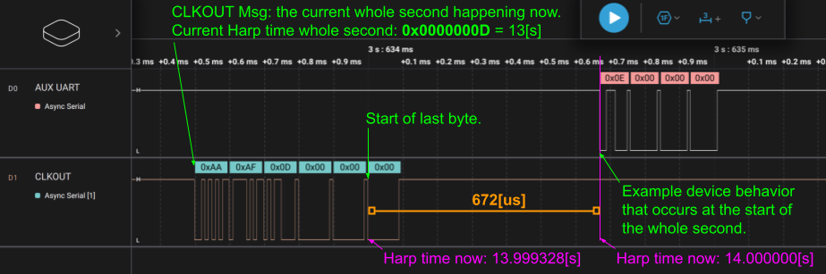

# Synchronization Clock Protocol (1.0)

## Introduction
The `Harp Synchronization Clock` is a dedicated bus that disseminates the current time to/across Harp devices. It is a serial communication protocol that relays the time information. The last byte in each message can be used as a trigger, and allows a `Device`` to align itself with the current `Harp` time.

## Serial configuration

* The Baud rate used is 100kbps;
* The last byte starts *exactly* 672 us before the elapse of the current second (e.g.:)

    

* The packet is composed of 6 bytes (`header[2]` and `timestamp_s[4]`):
  - `header[2] = {0xAA, 0xAF)`
  - `timestamp_s` is of type U32, little-endian, and contains the previous elapsed second.

A sample logic trace is shown below:
    

> **Important**
>
> To avoid unexpected behaviors, only one bit at a time should be written to register `R_RESET_DEV`.

## Example code

Example of a microcontroller C code dispatching the serialized data:

```C

ISR(TCD0_OVF_vect, ISR_NAKED)
    {
        if ((*timestamp_byte0 == 0xAA) && (*timestamp_byte1 == 0xAF)) reti();
        if ((*timestamp_byte1 == 0xAA) && (*timestamp_byte2 == 0xAF)) reti();
        if ((*timestamp_byte2 == 0xAA) && (*timestamp_byte3 == 0xAF)) reti();

        switch (timestamp_tx_counter)
        {
            case 1:
                USARTD1_DATA = 0xAA;
                break;
            case 2:
                USARTD1_DATA = 0xAF;
                break;
            case 4:
                USARTD1_DATA = *timestamp_byte0;
                break;
            case 6:
                USARTD1_DATA = *timestamp_byte1;
                break;
            case 7:
                USARTD1_DATA = *timestamp_byte2;
                break;
            // The final byte is dispatched much later than the previous 5.
            case 1998:
                USARTD1_DATA = *timestamp_byte3;
                break;
        }
    }
```

Example of a microcontroller C++ code for converting the four received encoded bytes to the timestamp:
````C
    #define HARP_SYNC_OFFSET_US (672)

    // Assume 4 bytes of timestamp data (without header) have been written to this array.
    alignas(uint32_t) volatile uint8_t sync_data_[4];

    // reinterpret 4-byte sequence as a little-endian uint32_t.
    uint32_t encoded_sec = *(reinterpret_cast<uint32_t*>(self->sync_data_));
    // Convert received timestamp to the current time in microseconds.
    // Add 1[s] per protocol spec since 4-byte sequence encodes the **previous** second.
    uint64_t curr_us = ((static_cast<uint64_t>(encoded_sec) + 1) * 1e6) - HARP_SYNC_OFFSET_US;
````

A full example of clocking in the 6-byte sequence can be found in the [Pico Core](https://github.com/AllenNeuralDynamics/harp.core.rp2040/blob/main/firmware/src/harp_synchronizer.cpp).

---


## Physical connection

The physical connection is made by a simple audio cable. In the same folder of this file, you can find an [example](./PhysicalConnector.pdf) of the sender and the receiver.
The connector used is from `Switchcraft Inc.` with PartNo. `35RASMT2BHNTRX`.

## Release Notes

- v1.0
    * First version.

- v1.1.0
  * Refactor documentation to markdown format.
  * Minor typo corrections.
  * Improve clarity of some sections.
  * Adopt semantic versioning.

- v1.1.1
  * Remove table of contents to avoid redundancy with doc generators.
