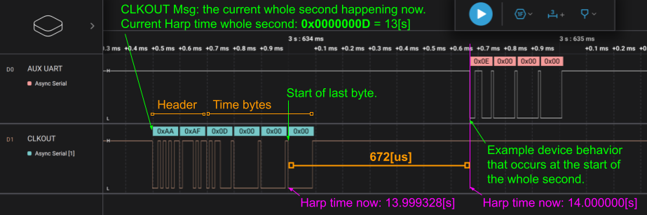
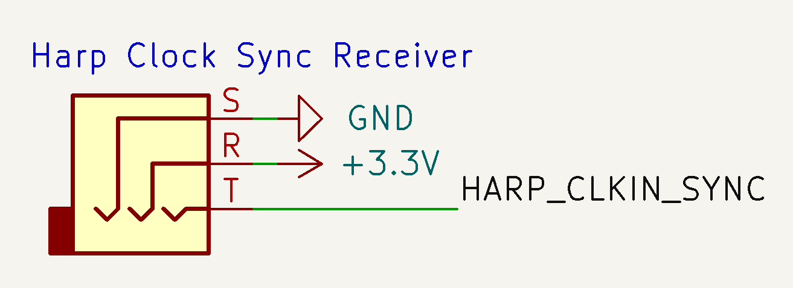
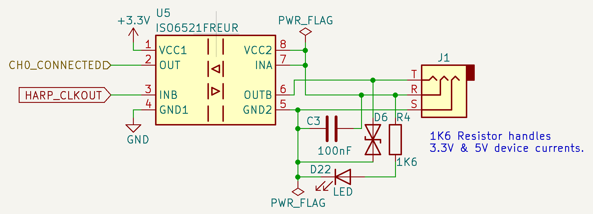

# Synchronization Clock Protocol

This document provides the specification for the Harp Synchronization Clock, a dedicated bus used to synchronize the current time across Harp devices with sub-millisecond accuracy.

## Requirements Language

The key words "MUST", "MUST NOT", "REQUIRED", "SHALL", "SHALL NOT", "SHOULD", "SHOULD NOT", "RECOMMENDED",  "MAY", and "OPTIONAL" in this document are to be interpreted as described in [RFC 2119](https://www.ietf.org/rfc/rfc2119.txt).

## Serial Interface

The Harp Synchronization Clock is a serial communication protocol for relaying time information over RS-232. Each message transmits the current timestamp, in whole seconds. The transmission of the last byte in each message is used as a synchronization signal, allowing Harp devices to align their clocks with sub-millisecond accuracy.

### Baud Rate

The baud rate for all transmitted data MUST be 100 kbps.

### Transmission Packet (6 bytes)

All Harp Synchronization Clock messages MUST use Little-Endian byte ordering and follow the structure below:

<table>
<tr>
    <th align="center">0</th>
    <th align="center">1</th>
    <th align="center">2</th>
    <th align="center">3</th>
    <th align="center">4</th>
    <th align="center">5</th>
</tr>
<tr>
    <td align="center">0xAA</td>
    <td align="center">0xAF</td>
    <td align="center" colspan="4">U32</td>
</tr>
<tr>
    <td align="center" colspan="2">Header</td>
    <td align="center" colspan="4">Previous Elapsed Second</td>
</tr>
</table>

### Transmission Timing

Transmission of the last byte MUST start exactly 672 μs before the current second lapses.

## Example Logic Trace

Example traces of the transmission signals are shown below from both a logic analyzer and an oscilloscope:

  

## Example code

Example microcontroller C code dispatching the serialized data:

```C

ISR(TCD0_OVF_vect, ISR_NAKED)
    {
        if ((*timestamp_byte0 == 0xAA) && (*timestamp_byte1 == 0xAF)) reti();
        if ((*timestamp_byte1 == 0xAA) && (*timestamp_byte2 == 0xAF)) reti();
        if ((*timestamp_byte2 == 0xAA) && (*timestamp_byte3 == 0xAF)) reti();

        switch (timestamp_tx_counter)
        {
            case 1:
                USARTD1_DATA = 0xAA;
                break;
            case 2:
                USARTD1_DATA = 0xAF;
                break;
            case 4:
                USARTD1_DATA = *timestamp_byte0;
                break;
            case 6:
                USARTD1_DATA = *timestamp_byte1;
                break;
            case 7:
                USARTD1_DATA = *timestamp_byte2;
                break;
            // The final byte is dispatched much later than the previous 5.
            case 1998:
                USARTD1_DATA = *timestamp_byte3;
                break;
        }
    }
```

Example of microcontroller C++ code for converting the four received encoded bytes to the timestamp:

````C
    #define HARP_SYNC_OFFSET_US (672)

    // Assume 4 bytes of timestamp data (without header) have been written to this array.
    alignas(uint32_t) volatile uint8_t sync_data_[4];

    // reinterpret 4-byte sequence as a little-endian uint32_t.
    uint32_t encoded_sec = *(reinterpret_cast<uint32_t*>(self->sync_data_));
    // Convert received timestamp to the current time in microseconds.
    // Add 1[s] per protocol spec since 4-byte sequence encodes the **previous** second.
    uint64_t curr_us = ((static_cast<uint64_t>(encoded_sec) + 1) * 1e6) - HARP_SYNC_OFFSET_US;
````

A full example demonstrating a state machine receiving the 6-byte sequence can be found in the [Pico Core](https://github.com/harp-tech/core.pico/blob/main/firmware/src/harp_synchronizer.cpp).

## Physical Connection

The physical connection for transmission of the Harp Synchronization Clock SHOULD be made by a 3.5 mm audio cable.

The connector pinout for a device *receiving* the timestamp is shown below:



The device receiving the timestamp MUST provide 3.3V-5V (~10 mA) on the connector **R** pin. A TVS diode is RECOMMENDED for ESD protection.

The schematic snippet for a device *sending* the timestamp is shown below:



> [!NOTE]
> The device *sending* the timestamp SHOULD isolate each clock output port, preventing ground loops from forming when connecting the audio jack between sender and receiver.

A supplementary PDF [example](./assets/PhysicalConnector.pdf) of the sender and the receiver is also available.
The connector used is from `Switchcraft Inc.` with PartNo. `35RASMT2BHNTRX`.

A KiCAD schematic template for creating a Harp device based on the [RP2040](https://www.raspberrypi.com/products/rp2040/) microcontroller with circuitry for receiving the timestamp is provided through the [Pico Template](https://github.com/AllenNeuralDynamics/harp.device.pico-template).

## Release Notes

- v1.0
    * First version.

- v1.1.0
  * Refactor documentation to markdown format.
  * Minor typo corrections.
  * Improve clarity of some sections.
  * Adopt semantic versioning.

- v1.1.1
  * Remove table of contents to avoid redundancy with doc generators.
