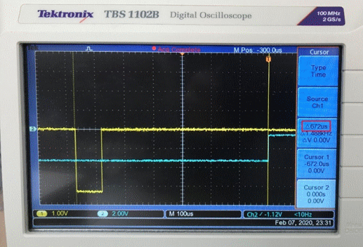

# Synchronization Clock Protocol (1.0)


## Introduction
The `Harp Synchronization Clock` is a bus that disseminates the current time to/across Harp devices.
It’s a serial communication protocol that relays the time information. The last byte in each message can be used as a trigger, and allow a Device to align itself with the current `Harp` time.

## Serial configuration

* The Baud rate used is 100kbps;
* The last byte starts *exactly* 672 us before the elapse of the current second (e.g.:)

    

* The packet is composed of 6 bytes (`header[2]` and `timestamp_s[4]`):
  - `header[2] = {0xAA, 0xAF)`
  - `timestamp_s` is of type U32, little-endian, and contains the current second.

> **Important**
>
> To avoid unexpected behaviors, only one bit at a time should be written to register `R_RESET_DEV`.
>

## Example code

Example of a microcontroller C code:

```C

ISR(TCD0_OVF_vect, ISR_NAKED)
    {
        if ((*timestamp_byte0 == 0xAA) && (*timestamp_byte1 == 0xAF)) reti();
        if ((*timestamp_byte1 == 0xAA) && (*timestamp_byte2 == 0xAF)) reti();
        if ((*timestamp_byte2 == 0xAA) && (*timestamp_byte3 == 0xAF)) reti();

        switch (timestamp_tx_counter)
        {
            case 1:
                USARTD1_DATA = 0xAA;
                break;
            case 2:
                USARTD1_DATA = 0xAF;
                break;
            case 4:
                USARTD1_DATA = *timestamp_byte0;
                break;
            case 6:
                USARTD1_DATA = *timestamp_byte1;
                break;
            case 7:
                USARTD1_DATA = *timestamp_byte2;
                break;
            case 1998:
                USARTD1_DATA = *timestamp_byte3;
                break;
        }
    }
```


## Physical connection

The physical connection is made by a simple audio cable. In the same folder of this file, you can find an [example](./synchronization%20clock%20-%20physical%20connectionsch.pdf) of the sender and the receiver.
The connector used is from `Switchcraft Inc.` with PartNo. `35RASMT2BHNTRX`.

## Release Notes

- V1.0
    * First version.
